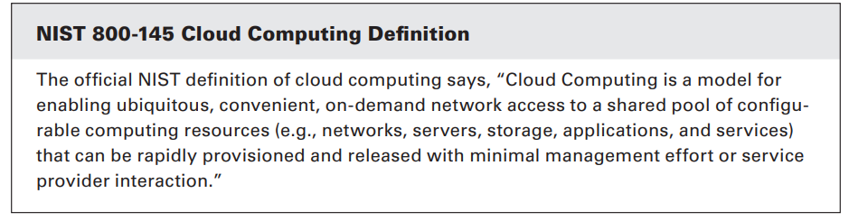
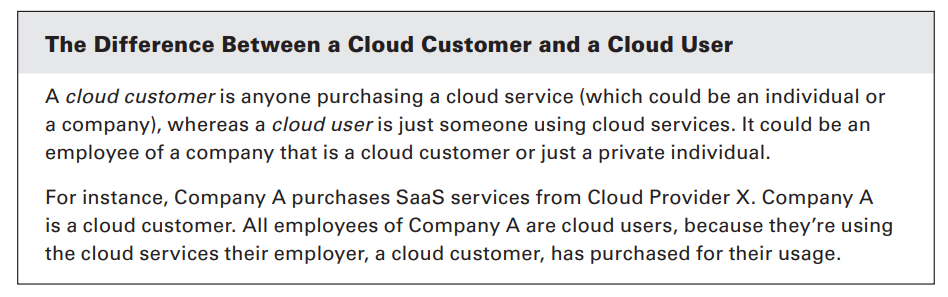

## 1. Cloud Computing Definitions:
   - Cloud computing refers to the delivery of computing services—including servers, storage, databases, networking, software, analytics, and intelligence—over the internet ("the cloud") to offer faster innovation, flexible resources, and economies of scale.
   - It encompasses various service models such as Infrastructure as a Service (IaaS), Platform as a Service (PaaS), and Software as a Service (SaaS), as well as deployment models like public cloud, private cloud, hybrid cloud, and multicloud.

   

## 2. Roles and Responsibilities:
   - **Cloud Service Customer:** The entity or individual who consumes cloud services. Responsibilities include defining requirements, managing usage, and ensuring compliance.
   - **Cloud Service Provider:** The organization that offers cloud services, responsible for maintaining the infrastructure, ensuring availability, security, and performance.
   - **Cloud Service Partner:** Entities that collaborate with cloud providers to enhance service offerings or provide additional functionalities.
   - **Cloud Service Broker:** Intermediaries who facilitate interactions between cloud service providers and consumers, offering value-added services like security, integration, and management.
   - **Regulator:** Entities or authorities responsible for governing and ensuring compliance with regulations related to cloud computing, such as data privacy and security standards.

## 3. Key Characteristics:
   - **On-demand self-service:** Users can provision computing resources as needed without human intervention from the service provider.
   - **Broad network access:** Services are accessible over the network through standard mechanisms, enabling ubiquitous access from various devices.
   - **Multi-tenancy:** Resources are shared among multiple users or tenants, maximizing efficiency and cost-effectiveness.
   - **Rapid elasticity:** Resources can be rapidly scaled up or down to accommodate changing workload demands.
   - **Scalability:** The ability to quickly and easily scale resources, both vertically (upward, adding more power to existing resources) and horizontally (outward, adding more resources).
   - **Resource pooling:** Provider's computing resources are pooled to serve multiple consumers, with different physical and virtual resources dynamically assigned and reassigned according to demand.
   - **Measured service:** Cloud systems automatically control and optimize resource usage by leveraging a metering capability at some level of abstraction appropriate to the type of service.

## 4. Building Block Technologies:
   - **Virtualization:** Enables the creation of virtual instances of computing resources, such as servers, storage, and networks, allowing better resource utilization and isolation.
   - **Storage:** Provides scalable and resilient storage solutions, including object storage, block storage, and file storage, accessible over the network.
   - **Networking:** Facilitates connectivity between cloud resources, users, and external networks, ensuring reliable and secure communication.
   - **Databases:** Offers managed database services for storing, managing, and analyzing structured and unstructured data.
   - **Orchestration:** Automates the provisioning, configuration, and management of cloud resources and services, ensuring consistency, scalability, and efficiency in deployment and operations.
