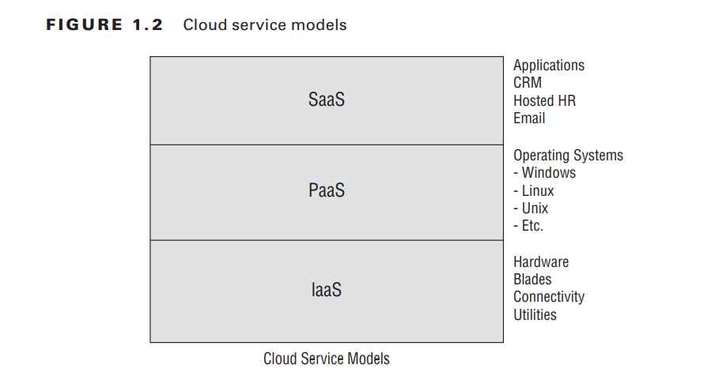
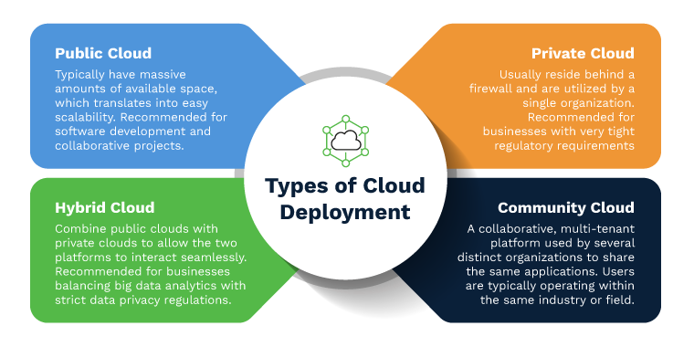

### Introduction to Cloud Reference Architecture

Cloud Reference Architecture (CRA) provides a structured approach to designing and implementing cloud-based solutions. It encompasses various aspects such as computing activities, service capabilities, service categories, deployment models, and shared considerations.

### Cloud Computing Activities

Cloud computing activities refer to the operations and tasks performed within a cloud environment. These activities include:

- **Provisioning**: Allocating resources such as virtual machines, storage, and networking.
- **Scaling**: Adjusting resource capacity based on demand to ensure optimal performance and cost-effectiveness.
- **Monitoring and Management**: Monitoring system health, performance, and security, and managing cloud resources efficiently.
- **Security and Compliance**: Implementing security measures to protect data and comply with regulations.
- **Data Management**: Storing, retrieving, and processing data efficiently and securely.
- **Networking**: Establishing and managing connections between cloud resources and users or other cloud services.

### Service Categories

Cloud services are categorized based on delivery models:

- **Software as a Service (SaaS)**: Applications hosted and managed by a service provider and accessed over the internet.
- **Platform as a Service (PaaS)**: Development and deployment platforms provided as a service, allowing developers to build, deploy, and manage applications without dealing with underlying infrastructure.
- **Infrastructure as a Service (IaaS)**: Virtualized computing resources, including servers, storage, and networking, provided as a service.

### Deployment Models

Cloud deployments can be categorized into various models:

- **Public Cloud**: Services provided over the internet by third-party providers and accessible to anyone.
- **Private Cloud**: Cloud infrastructure dedicated to a single organization, offering greater control and security.
- **Hybrid Cloud**: Combination of public and private cloud services, allowing data and applications to be shared between them.
- **Community Cloud**: Infrastructure shared by several organizations with common concerns, such as regulatory compliance or security requirements.

### Shared Considerations

Various considerations must be addressed when designing and implementing cloud solutions:

- **Interoperability**: Ensuring different systems and services can work together seamlessly.
- **Portability**: Ability to move applications and data between different cloud environments.
- **Security and Privacy**: Protecting data and ensuring compliance with privacy regulations.
- **Resiliency and Availability**: Ensuring services are available and resilient to failures.
- **Performance**: Optimizing performance to meet user expectations.
- **Governance and Compliance**: Implementing policies and controls to comply with regulations and organizational standards.
- **Maintenance and Versioning**: Managing updates and changes to cloud resources.
- **Service Levels and Agreements (SLA)**: Defining performance metrics and service level agreements.
- **Auditability**: Ensuring transparency and accountability through auditing and logging.
- **Regulatory and Legal Considerations**: Compliance with laws and regulations governing data handling and privacy.
- **Outsourcing**: Assessing risks and benefits of outsourcing cloud services.

