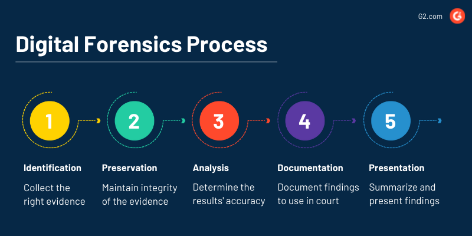
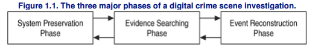
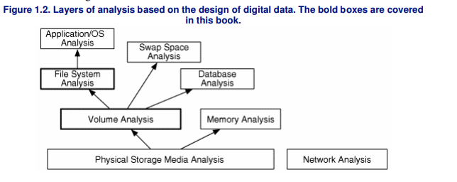

# Overview of Digital Forensics

## Definition and Purpose of Digital Forensics

### Definition:
Digital Forensics is the application of scientific methods and techniques to collect, analyze, and preserve digital evidence in a way that is legally admissible.

### Purpose:
The primary purpose of digital forensics is to investigate and analyze digital devices and systems to uncover evidence of cybercrime, fraud, or other malicious activities.

### Key Components:

- **Evidence Collection:** Gathering data from digital devices without altering its integrity.
- **Analysis:** Examining collected data to reconstruct events and identify patterns.
- **Preservation:** Ensuring the integrity and admissibility of evidence for legal proceedings.

### Digital Crime Scene Investigation Process

#### Layers of Analysis

## Key Objectives and Goals of Digital Forensics Investigations

### Objectives:
1. **Identification of Evidence:**
   - Locate and identify relevant digital evidence within a given investigation scope.
2. **Preservation of Evidence:**
   - Ensure the integrity and preservation of digital evidence throughout the investigative process.
3. **Analysis and Reconstruction:**
   - Analyze digital artifacts to reconstruct events and understand the sequence of activities.

### Goals:
1. **Legal Admissibility:**
   - Prepare digital evidence in a manner that meets legal standards for admissibility in court.
2. **Identification of Perpetrators:**
   - Determine the individuals responsible for cybercrimes or unauthorized activities.
3. **Prevention and Mitigation:**
   - Implement measures to prevent future incidents based on findings.

# Importance of Digital Forensics

## Role of Digital Forensics in Cybersecurity

### Cybersecurity Challenges:
Digital forensics plays a crucial role in addressing cybersecurity challenges, including:
- Investigating security incidents.
- Identifying vulnerabilities and weaknesses.
- Assessing the impact of cyber attacks.

### Incident Response:
Digital forensics is an integral part of incident response strategies, helping organizations to:
- Detect and respond to security incidents promptly.
- Mitigate the impact of breaches.

## Contributions of Digital Forensics to Law Enforcement

### Support in Criminal Investigations:
Digital forensics assists law enforcement agencies by:
- Providing evidence in cybercrime investigations.
- Tracing digital footprints to identify suspects.

### Prosecution and Legal Proceedings:
Digital evidence collected through forensics is essential for successful prosecution in criminal cases.
Ensures a legally sound chain of custody to maintain the admissibility of evidence.

# Applications of Digital Forensics

## Use Cases in Criminal Investigations

### Types of Crimes Investigated:
Digital forensics is employed in investigating a wide range of cybercrimes, including:
- Hacking and unauthorized access.
- Digital fraud and financial crimes.
- Distribution of malicious software.

### Digital Evidence Types:
Common types of digital evidence include:
- Log files, network traffic analysis, and system artifacts.
- Recovered deleted files and communication records.

