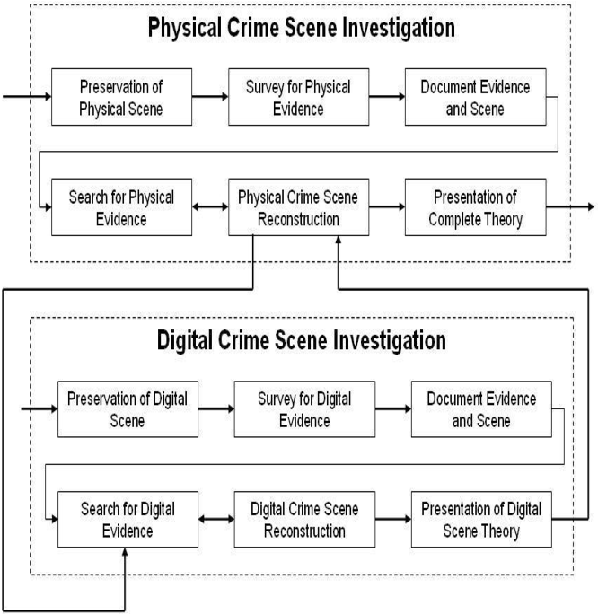

### I. Introduction to Digital Evidence

- **Definition:** Digital evidence refers to any information stored or transmitted in digital form that can be used as proof in legal proceedings.
- **Importance:** In modern society, digital evidence plays a crucial role in investigations and court cases due to the widespread use of technology.
- **Examples:** Emails, text messages, social media posts, digital photos, and computer files are common forms of digital evidence.

### II. Types of Digital Evidence

- **Active Data:** Information currently in use or accessed on electronic devices, such as open documents or running applications.
- **Residual Data:** Data that remains on storage devices even after deletion or formatting, including deleted files or temporary data.
- **Metadata:** Descriptive information about other data, such as timestamps, file properties, or geolocation data.
- **Network Data:** Information transmitted over computer networks, like emails, chat logs, or network traffic captures.
- **Cloud Data:** Data stored on remote servers accessible via the internet, including cloud backups, online documents, or email archives.

[Types of Digital Evidence](https://www.salvationdata.com/knowledge/8-types-of-digital-evidence/)

### III. Collection and Preservation of Digital Evidence

- **Initial Assessment:** Determine the scope and objectives of the investigation and identify potential sources of digital evidence.
- **Legal Considerations:** Ensure compliance with laws and regulations governing the collection and use of digital evidence, including obtaining necessary warrants or subpoenas.
- **Identification and Isolation:** Secure the scene to prevent contamination or tampering and document the condition of electronic devices.
- **Acquisition:** Use forensic tools to create forensic images of digital evidence while maintaining its integrity through write-blocking mechanisms.
- **Documentation:** Maintain detailed records of the collection process, including chain of custody documentation, timestamps, and relevant information.

### IV. Chain of Custody

- **Definition and Importance:** Chain of custody refers to the chronological documentation of the handling of evidence, ensuring its integrity and admissibility in court.
- **Components:** Identification, Documentation, and Security are essential components of the chain of custody, ensuring the reliability of digital evidence.
- **Roles and Responsibilities:** Investigators, forensic examiners, law enforcement, and legal professionals all have roles in maintaining the chain of custody and preserving evidence integrity.
- **Admissibility in Court:** Properly maintained chain of custody documentation serves as a foundation for admitting digital evidence in court, although challenges may arise that need to be addressed.
