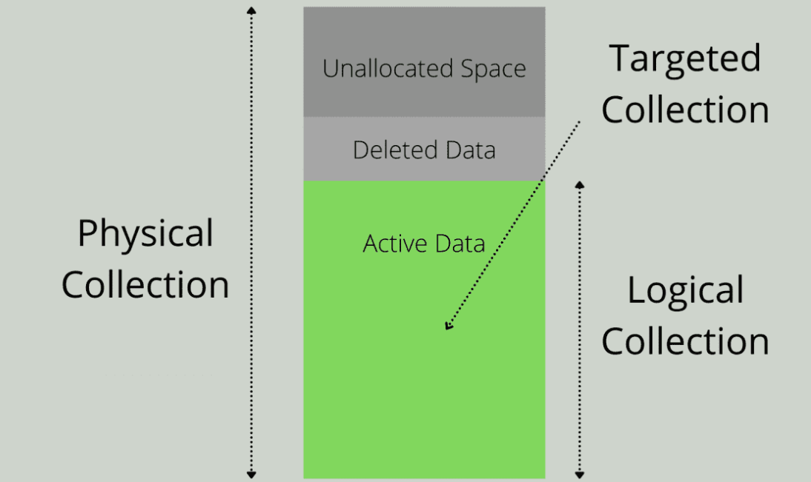

## Forensic Imaging

Forensic imaging is a critical process in digital forensics, involving the creation of exact copies of digital storage media for analysis and preservation of evidence.

### Disk Imaging Techniques

Disk imaging techniques are used to create bit-by-bit copies of digital storage media, ensuring the preservation of data integrity.

1. **Full Disk Imaging**
   - Captures the entire contents of a storage device, including allocated and unallocated space.
   - Provides a complete picture of the device's data, including deleted files and system artifacts.

2. **Logical Imaging**
   - Selectively copies specific files or directories from the storage media.
   - Useful for targeted investigations or when time or storage space is limited.

3. **Live Imaging**
   - Captures the contents of a running system, including open files and system state.
   - Requires specialized tools to ensure data consistency and integrity.

[Forensic Imaging](https://www.techtarget.com/whatis/definition/forensic-image)

[Disk Imaging](https://ctf101.org/forensics/what-is-disk-imaging/)

[Types of Forensic Collection](https://percipient.co/overview-the-three-types-of-forensic-collections-physical-vs-logical-vs-targeted/)

### Write-Blocking Devices

Write-blocking devices are hardware or software tools used to prevent any write operations to the original storage media during the imaging process.

1. **Hardware Write-Blockers**
   - Physical devices that connect between the storage media and the forensic workstation.
   - Block write commands while allowing read commands to access the data.
   - Ensure the preservation of original evidence by preventing accidental or intentional alterations.

2. **Software Write-Blockers**
   - Software applications that run on the forensic workstation to control access to the storage media.
   - Emulate the functionality of hardware write-blockers by intercepting write commands.
   - Require careful configuration and testing to ensure effectiveness.

### Image Acquisition and Verification

Image acquisition involves the process of capturing the forensic image from the original storage media, while verification ensures the integrity and authenticity of the acquired image.

1. **Acquisition Process**
   - Use forensic imaging software to create a bit-by-bit copy of the storage media.
   - Verify the integrity of the acquired image using cryptographic hashes or checksums.
   - Document the acquisition process, including timestamps and relevant metadata.

2. **Verification Techniques**
   - **Hashing Algorithms:** Use cryptographic hash functions (e.g., MD5, SHA-1, SHA-256) to generate unique identifiers for the acquired image.
   - **Hash Verification:** Compare the hash value of the acquired image with the hash value of the original storage media to ensure integrity.
   - **Read Verification:** Verify the readability of the acquired image by mounting it as a virtual drive and accessing its contents.
