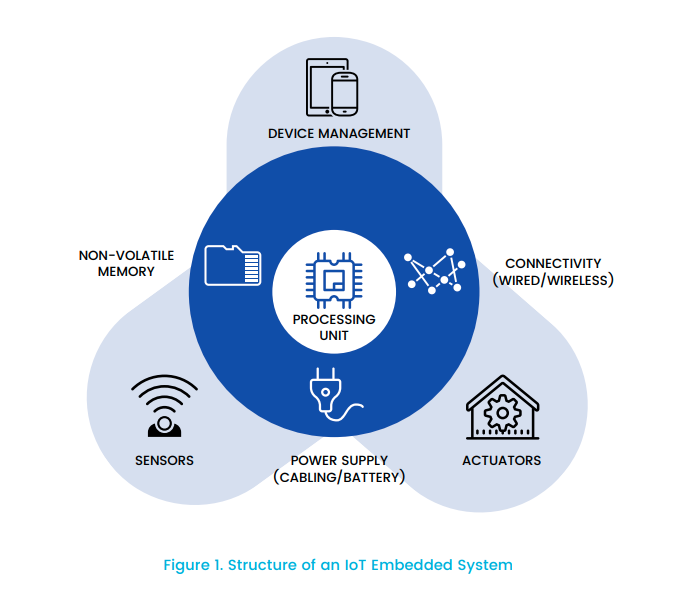

## Introduction to IoT Security

### Overview of IoT Devices:

- **Definition:** IoT devices are physical objects embedded with sensors, software, and other technologies to connect and exchange data over the internet.
- **Types of IoT Devices:** Examples include smart thermostats, wearable fitness trackers, connected appliances, industrial sensors, etc.
- **Characteristics:**
  - **Connectivity:** IoT devices typically connect to the internet or other devices through various communication protocols like Wi-Fi, Bluetooth, Zigbee, etc.
  - **Sensors and Actuators:** These devices gather data from the environment through sensors and may take actions based on that data using actuators.
  - **Data Processing:** IoT devices often have limited processing capabilities, relying on cloud or edge computing for data analysis and decision-making.

### Significance of IoT Security:

- **Protection of Sensitive Data:** IoT devices collect and transmit vast amounts of sensitive data, including personal information, health data, and industrial secrets. Securing this data is paramount to prevent unauthorized access and misuse.
- **Prevention of Malicious Attacks:** Vulnerable IoT devices can be exploited by hackers to launch various attacks, such as data breaches, DDoS attacks, and ransomware attacks, posing significant risks to individuals, organizations, and critical infrastructure.
- **Preservation of Safety and Privacy:** Inadequately secured IoT devices can compromise user safety (e.g., compromised medical devices) and infringe upon privacy rights (e.g., unauthorized surveillance through smart cameras).

### Challenges in Securing IoT:

- **Diversity of Devices:** The IoT ecosystem comprises a wide range of devices with varying capabilities, architectures, and communication protocols, making it challenging to develop standardized security measures.
- **Resource Constraints:** Many IoT devices have limited computational power, memory, and battery life, constraining the implementation of robust security mechanisms.
- **Lifecycle Management:** IoT devices often have long lifecycles and may not receive regular software updates and patches, leaving them vulnerable to known vulnerabilities and exploits.
- **Interoperability Issues:** Ensuring compatibility and secure communication among heterogeneous IoT devices from different manufacturers is complex and prone to interoperability issues.
- **Privacy Concerns:** IoT devices constantly collect and transmit data, raising concerns about user privacy and the potential for data misuse or unauthorized access.

#### 1. Overview of IoT Devices:

- IoT devices are physical objects equipped with sensors, software, and connectivity features.
- Examples include smart home devices (thermostats, door locks, cameras), wearable devices (fitness trackers, smartwatches), industrial sensors (environmental monitors, asset trackers), and more.
- These devices collect, process, and transmit data to enable various functionalities, such as monitoring, automation, and optimization.

#### 2. Significance of IoT Security:

- IoT security is crucial for protecting sensitive data collected and transmitted by IoT devices.
- Vulnerable IoT devices can be exploited by malicious actors to launch attacks, compromising user privacy, safety, and the integrity of data and systems.
- Effective IoT security measures are essential to prevent unauthorized access, data breaches, and other cybersecurity threats.

#### 3. Challenges in Securing IoT:

- The diversity of IoT devices presents challenges in developing standardized security measures.
- Resource-constrained IoT devices may struggle to implement robust security mechanisms.
- Lifecycle management issues, interoperability concerns, and privacy considerations further complicate IoT security efforts.
- Addressing these challenges requires a multidisciplinary approach involving stakeholders from industry, academia, and government to develop and implement effective IoT security solutions.

### IoT Applications:

IoT applications involve the integration of various devices, sensors, and software systems to enable the collection, analysis, and utilization of data for diverse purposes. These applications span across industries and domains

