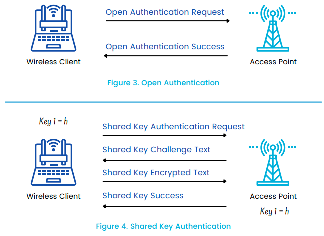

# IoT Device Authentication and Authorization

## Introduction to IoT Device Authentication and Authorization

IoT Device Authentication and Authorization are crucial aspects of IoT security, ensuring that only legitimate devices can access resources and perform actions within an IoT ecosystem.

## Identity Management for IoT Devices

- **Definition**: Identity management involves uniquely identifying and managing IoT devices throughout their lifecycle.
- **Key Components**:
  - *Unique Identifiers*: Each IoT device should have a unique identifier, such as MAC addresses or serial numbers, to differentiate it from others.
  - *Device Registries*: Maintaining registries to track and manage device identities, attributes, and ownership information.
  - *Lifecycle Management*: Managing devices from provisioning to decommissioning, including onboarding, updates, and revocation of privileges.

## Authentication Protocols

- **Definition**: Authentication protocols validate the identity of IoT devices before granting access to resources or services.
- **Common Protocols**:
  - *TLS (Transport Layer Security)*: Secure communication protocol providing encryption and authentication between IoT devices and servers.
  - *OAuth (Open Authorization)*: Protocol for token-based authentication, allowing IoT devices to access resources on behalf of users securely.
  - *JWT (JSON Web Tokens)*: Compact, URL-safe tokens for securely transmitting authentication and authorization data between parties.

## Authorization Mechanisms

- **Definition**: Authorization mechanisms define what actions IoT devices are allowed to perform after authentication.
- **Types of Authorization**:
  - *Role-Based Access Control (RBAC)*: Assigning permissions to IoT devices based on predefined roles or groups.
  - *Attribute-Based Access Control (ABAC)*: Making authorization decisions based on attributes associated with IoT devices, users, or resources.
  - *Policy-Based Access Control*: Enforcing access control policies that specify conditions under which IoT devices are granted or denied access to resources.

