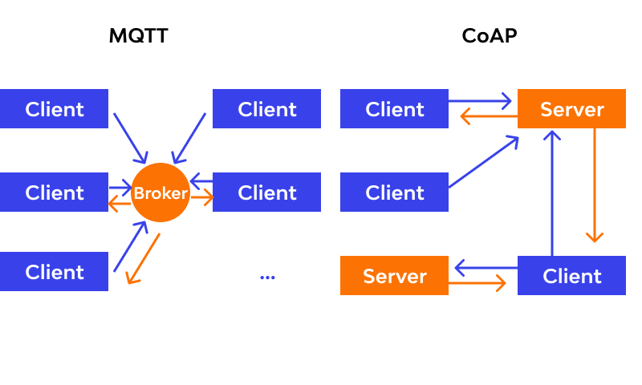

## Secure Communication Protocols for IoT

### 1. Transport Layer Security (TLS)

Transport Layer Security (TLS) is a cryptographic protocol designed to provide secure communication over a network. It ensures data confidentiality, integrity, and authenticity between communicating applications. In the context of IoT, TLS plays a crucial role in securing communication between IoT devices and servers.

**Key Features of TLS:**
- **Encryption:** TLS encrypts data to prevent unauthorized access during transmission. It uses symmetric encryption for efficiency and asymmetric encryption for key exchange.
- **Data Integrity:** TLS ensures that data remains intact and unaltered during transit by using cryptographic hash functions.
- **Authentication:** It verifies the identities of communicating parties using digital certificates, thereby preventing man-in-the-middle attacks.
- **Forward Secrecy:** TLS supports forward secrecy, ensuring that past communications remain secure even if long-term keys are compromised in the future.

**Implementation Considerations:**
- **Version Compatibility:** IoT devices should support TLS versions compatible with their capabilities while ensuring security against known vulnerabilities.
- **Resource Constraints:** IoT devices often have limited computational resources. Optimized implementations of TLS are necessary to minimize computational overhead.
- **Certificate Management:** Proper management of digital certificates is crucial to ensure the authenticity of communicating parties. IoT devices should be equipped to handle certificate validation efficiently.

[TLS (Transport Layer Security) And IoT Devices](https://blog.espressif.com/esp32-tls-transport-layer-security-and-iot-devices-3ac93511f6d8)

### 2. Datagram Transport Layer Security (DTLS)

Datagram Transport Layer Security (DTLS) is a variation of TLS designed to operate over datagram protocols like UDP, which are commonly used in IoT environments. DTLS provides similar security guarantees as TLS but is tailored for the unreliable nature of datagram communication.

**Key Features of DTLS:**
- **Connectionless Security:** DTLS operates without requiring a persistent connection, making it suitable for communication over unreliable networks like UDP.
- **Handshake Protocol:** DTLS includes a handshake protocol similar to TLS for key exchange and negotiation of cryptographic parameters.
- **Fragmentation:** DTLS supports message fragmentation and reassembly to accommodate the limited payload size of UDP datagrams.
- **Anti-Replay Protection:** To mitigate replay attacks, DTLS includes mechanisms to detect and discard duplicate or out-of-order packets.

**Implementation Considerations:**
- **Compatibility:** IoT devices and servers must support DTLS to establish secure communication over datagram protocols.
- **Overhead:** DTLS adds overhead to communication due to cryptographic operations and message fragmentation. Implementations should optimize resource usage to minimize overhead.
- **Timeouts and Retransmissions:** Since UDP does not provide built-in reliability mechanisms, DTLS implementations must handle timeouts and retransmissions to ensure message delivery.

### 3. MQTT and CoAP Security

MQTT (Message Queuing Telemetry Transport) and CoAP (Constrained Application Protocol) are lightweight messaging protocols commonly used in IoT deployments. Securing MQTT and CoAP communications is essential to protect sensitive data and prevent unauthorized access.

**MQTT Security:**
- **Authentication:** MQTT supports username/password authentication and client certificates to verify the identity of clients.
- **Authorization:** Access control lists (ACLs) can be configured on MQTT brokers to restrict clients' access to specific topics.
- **Encryption:** TLS can be used to encrypt MQTT traffic, providing confidentiality and integrity.
- **Message Integrity:** Implementations can use message digests or digital signatures to ensure the integrity of MQTT messages.

**CoAP Security:**
- **DTLS Support:** CoAP can leverage DTLS for secure communication over UDP, providing similar security guarantees as TLS.
- **Authentication and Authorization:** CoAP supports various authentication methods, including pre-shared keys and certificates, to authenticate clients and servers. Access control mechanisms can be implemented using CoAP's resource directory or external authorization servers.
- **Message Encryption:** Similar to MQTT, CoAP can utilize DTLS for encryption to protect message confidentiality and integrity.

**Implementation Considerations:**
- **Protocol Specifics:** Secure implementations of MQTT and CoAP should adhere to protocol specifications and recommended security practices.
- **Resource Constraints:** IoT devices may have limited resources, necessitating lightweight cryptographic algorithms and efficient implementations.
- **Key Management:** Proper key management practices are essential to safeguard cryptographic keys and certificates used for authentication and encryption.
- **Firmware Updates:** Regular firmware updates are crucial to patch security vulnerabilities and ensure the continued security of IoT devices and servers.

