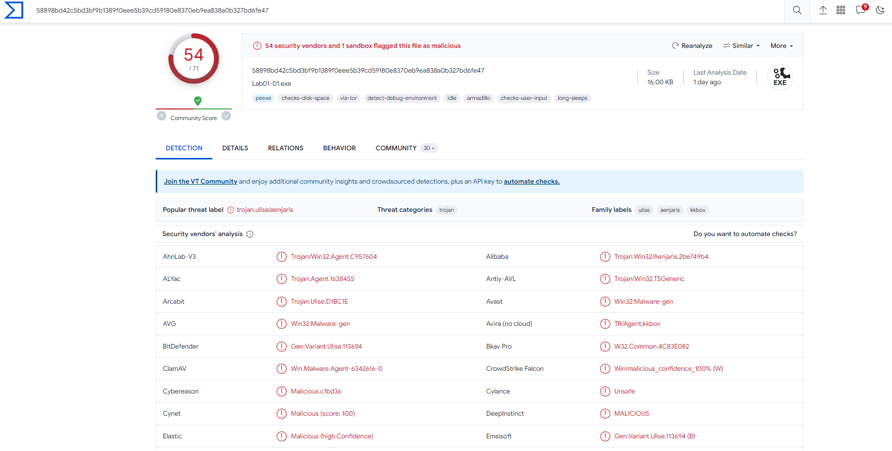

## Lab 1-1 (Lab01-01.exe and Lab01-01.dll)

**1. Upload the files to http://www.VirusTotal.com/ and view the reports. Does either file match any existing antivirus signatures?**

**2. When were these files compiled?**

Lab01-01.dll Compilation Date: Sun, Dec 19 2010, 16:16:38 - 32 Bit DLL
Lab01-01.exe Compilation Date: Sun, Dec 19 2010, 16:16:19 - 32 Bit EXE

**How PEiD check files?**

**Packer Signatures:** PEiD contains a database of signatures associated with various packers and compressors. These signatures are specific byte sequences or patterns that are characteristic of certain packing tools. PEiD compares these signatures against the analyzed file to identify the presence of a particular packer.

**Entropy Analysis:** Entropy is a measure of randomness within a file. Packed files often exhibit higher entropy compared to unpacked ones due to the compression or encryption applied. PEiD calculates the entropy of specific sections or the entire file and uses this information to make an assessment.

**Section Characteristics:** Packed files may have sections with unusual names, sizes, or characteristics. PEiD looks at the section headers of the PE file and examines whether they deviate from the standard characteristics expected in a compiled executable.

**Import Table Analysis:** Packed executables may modify the Import Address Table (IAT) to hide or obfuscate imported functions. PEiD checks the imported libraries and functions to identify any alterations that could be indicative of packing.

**Resource Section Examination:** Packed files may store their compressed or encrypted payload within the resource section. PEiD examines the resource section for irregularities or patterns that match known packers.

**Code Section Analysis:** Packed files often have code sections that exhibit specific characteristics, such as self-modifying code or runtime decryption routines. PEiD may analyze the code section to identify such behaviors.

**Compiler and Linker Information:** PEiD also looks at information related to the compiler and linker used to create the executable. Certain compilers are more commonly associated with packed files.
**Heuristic Analysis:** PEiD employs heuristics based on experience and knowledge of common packing techniques. These heuristics may include checks for specific instructions or sequences that are typical in packed files.

**3. Are there any indications that either of these files is packed or obfuscated? If so, what are these indicators?**
 
Lab01-01.dll Not Packed and Not Obfuscated

Lab01-01.exe Not Packed and Not Obfuscated

**4. Do any imports hint at what this malware does? If so, which imports are they?**

Imports of Lab01-01.dll

Imports of Lab01-01.exe

**5. Are there any other files or host-based indicators that you could look for on infected systems?**

**Host-based indicators** in malware analysis are signs of malicious activity found on an individual system. Examples include unusual files, changes to the Windows Registry, suspicious network connections, unauthorized processes, and alterations to user accounts or system logs. Analyzing these indicators helps identify and mitigate the impact of malware on a specific host.

**6. What network-based indicators could be used to find this malware on infected machines?**

**Network-based indicators** in malware analysis are observable patterns of malicious behavior at the network level. Examples include connections to known malicious IP addresses, communication with suspicious domains, unusual traffic patterns, and exploitation attempts through specific protocols or ports. Analyzing these indicators helps identify and block malicious activities within a network.

**7. What would you guess is the purpose of these files?**

- Lab01-01.dll might be backdoor malware because of unusual IP addres usage: 127.26.152.13 and ***WS2_32.dll*** import.

Indicators of a **backdoor** include unusual network traffic patterns,unusual IP addresses, unexpected process behaviors, unauthorized access attempts, irregular system activities, abnormal resource usage, changes in registry entries, persistence mechanisms, code injection techniques, encryption or obfuscation, and communication with command and control servers. Monitoring for these signs helps detect and respond to the presence of backdoors on compromised systems.

- Lab01-01.exe imports FindNextFile and CopyFile. This file purpose might be search a file, find and executed. May use for execute Lab01.01.dll

## Lab 1-2 (Lab01-02.exe)

#### 1. Upload the Lab01-02.exe file to http://www.VirusTotal.com/. Does it match any existing antivirus definitions?

#### 2. Are there any indications that this file is packed or obfuscated? If so, what are these indicators? If the file is packed, unpack it if possible.

[Unpacking Malware Medium Blogpost](https://medium.com/@dbragetti/unpacking-malware-685de7093e5)

Lab01-02.exe packed

- Virtual size and raw size of the Lab01-02.exe not match. This is a indicator of packed file.

- Unpackking File

#### 3. Do any imports hint at this program’s functionality? If so, which imports are they and what do they tell you?

**Imports of packed .exe**

**Imports of unpacked .exe**

#### 4. What host- or network-based indicators could be used to identify this malware on infected machines?

Some suspicious indicators:
    - `MalService`
    - `Malservice`
    - `HGL345`
    - `http://www.malwareanalysisbook.com`

## Lab 1-3 (Lab01-03.exe)

#### 1. Upload the Lab01-03.exe file to http://www.VirusTotal.com/ Does it match any existing antivirus definitions?

#### 2. Are there any indications that this file is packed or obfuscated? If so, what are these indicators? If the file is packed, unpack it if possible.

[Unpacking File with FSG](https://www.mnin.org/write/2006_unpacking_fsg.pdf)

Lab01-03.exe: packed

- Virtual size more than raw size.

#### 3. Do any imports hint at this program’s functionality? If so, which imports are they and what do they tell you?

#### 4. What host- or network-based indicators could be used to identify this malware on infected machines?

## Lab 1-4 (Lab01-04.exe)

#### 1. Upload the Lab01-04.exe file to http://www.VirusTotal.com/. Does it match any existing antivirus definitions?

#### 2. Are there any indications that this file is packed or obfuscated? If so, what are these indicators? If the file is packed, unpack it if possible.

#### 3. When was this program compiled?

Creation Time on VirusTotal
2019-08-30 22:26:59 UTC

Creation Time on file properties
2/2/2024 12:46:30 PM
Modified Time on file properties
7/5/2011 8:16:15 PM

This value from file header. So, this looks like fake file creation time. 

[Windows timestomping](https://alexsta-cybersecurity.com/how-to-detect-timestomping-on-a-windows-system/)

#### 4. Do any imports hint at this program’s functionality? If so, which imports are they and what do they tell you?

**Imports of the Lab001-04.exe**

***advapi32.dll*** is a crucial dynamic-link library (DLL) in Windows. It provides functions for security, registry operations, service management, event logging, user account management, and system information. It is a fundamental component of the Windows API, essential for system-related tasks in Windows applications.

Suspicious imports under ADVAPI32.DLL:
- OpenProcessToken
- LookupPrivilegeValueA
- AdjustTokenPrivileges

According to imports this malware might try to retrieve privilege token of windows api or elevate token with privileged rights.  

***kernel32.dll*** is a vital dynamic-link library (DLL) in Windows, providing core functions for memory management, file operations, process and thread management, system information, error handling, and hardware abstraction. It serves as a bridge between applications and the Windows kernel, ensuring essential system-level operations.

Suspicious imports under KERNEL32.DLL:
- CreateFileA
- WriteFile
- WinExec
- MoveFileA

Accirding to this imports malware focus on create a file and try to execute it.

#### 5. What host- or network-based indicators could be used to identify this malware on infected machines?

We can look for strings of the binary to detect some indicators:

Host-based indicators:

- `\system32\wupdmgr.exe` &rarr; There is a legitimate Windows process called wuauclt.exe (Windows Update AutoUpdate Client) that is responsible for checking for Windows updates. It's worth noting that malware or malicious software often disguises itself using names similar to legitimate processes to avoid detection.

- `\winup.exe`  &rarr; Many malware use `\winup.exe` for impersonating activity an it might be malicious indicator.

Network-based indicators:

- `http://www.practicalmalwareanalysis.com/updater.exe`

#### 6. This file has one resource in the resource section. Use Resource Hacker to examine that resource, and then use it to extract the resource. What can you learn from the resource?

[How to detect embedded executable](https://hazmalware.wordpress.com/2009/09/01/how-to-identify-embedded-executables/)

When I save the binary and check on Dependency Walker imported function not exactly match on Lab001-04.exe. This validates the embedded function used in original exe.

**.bin functions**

**Lab001-04.exe functions**

So `URLDownloadToFileA` function is embedded function from `URLMON.DLL`