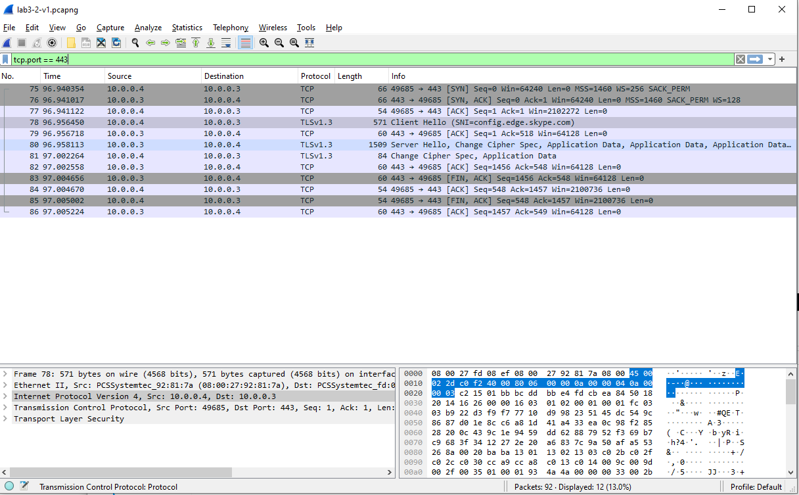

## Lab 3-1(Lab03-01.exe)

#### 1. What are this malware’s imports and strings?

Some suspicious strings:
- `CONNECT %s:%i HTTP/1.0`
- `www.practicalmalwareanalysis.com`
- `VideoDriver`
- `SOFTWARE\Classes\http\shell\open\commandV`
- `test`
- `kernel32.dll`
- `WinVMX32-`
- `vmx32to64.exe`

Only imports for first look:
- kernel32.dll &rarr; ExitProcess

#### 2-a What are the malware’s host-based indicators?

#### 2-b Are there any useful network-based signatures for this malware? If so, what are they?

According to answer of this lab malware should beacon over port 443 with WriteFile. But I cannot establish file write event while dynamic analaysis.

I can create ApateDNS on Windows machine and running inetsim on remnux machine.
Try to capture packet while running malware.
I can observe some TCP packets over port 443

Also according to answer malware create mutex and registry edit events. But i cannot observe that on ProcessExplorer because when malware executed automatically terminated after a while. I check some writeups of this lab and this issue might couse by Windows OS version. My malware analysis lab Windows10 and labs mostly writed for Windows7 and XP.

Network base indicators:
- `CONNECT %s:%i HTTP/1.0`
- `www.practicalmalwareanalysis.com`