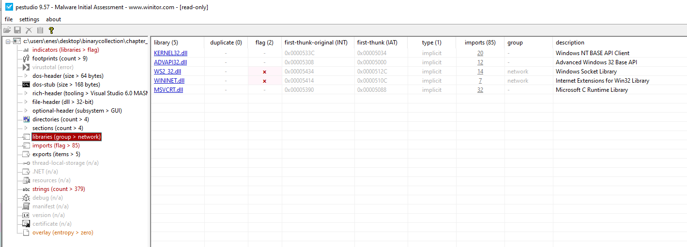
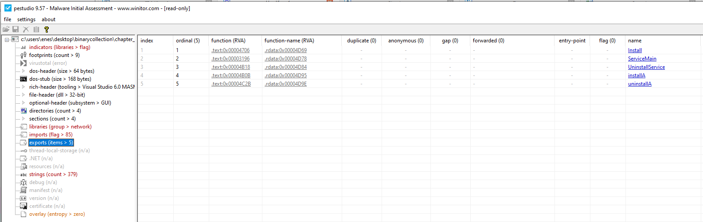

## Lab 3-2 Lab03-02.dll

#### 1. How can you get this malware to install itself?

When I checked strings of the `Lab03-02.dll` relaize that import itself.

Imports:

Exports:

Some suspicious imported functions:
- CreateServiceA
- RegSetValueExA
- HttpOpenRequestA
- HttpSendRequestA

According to this imported function malware might try to:
- Create a specific service to suspicious operations.
- Windows Registry change.
- Http request.

I tried to focus on these 3 types of operations and tried to find some indicators.

I cannot run this .dll for the dynamic analysis with this command
`rundll.exe Lab03-02.dll`

I need to specify function to run dll from export function.
`rundll.exe Lab03-02.dll,installA`

I did not observe any indicators such as Http event or any related registry change on my Windows10 machine. So, I need to install Windows XP for this dll malware analysis.

2. How would you get this malware to run after installation?
3. How can you find the process under which this malware is running?
4. Which filters could you set in order to use procmon to glean
information?
5. What are the malware’s host-based indicators?
6. Are there any useful network-based signatures for this malware?