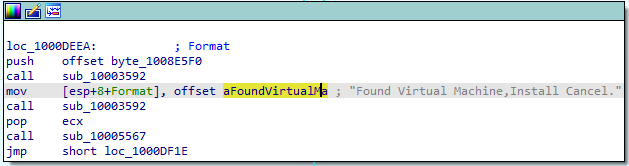

## Lab 5-1 Lab05-01.dll

Analyze the malware found in the file Lab05-01.dll using only IDA Pro. The
goal of this lab is to give you hands-on experience with IDA Pro. If you’ve
already worked with IDA Pro, you may choose to ignore these questions and
focus on reverse-engineering the malware.

**1. What is the address of DllMain?**

`DllMainAddress` &rarr; `.text:1000D02E`

**2. Use the Imports window to browse to gethostbyname. Where is the import located?**

`DllMainAddress` &rarr; `.idata:100163CC`

**3. How many functions call gethostbyname?**

9 times *gethostbyname* function called.
(Type p: referance call - Type r: referance read)

**4. Focusing on the call to `gethostbyname` located at `0x10001757`, can you figure out which DNS request will be made?**

Check the function call at `0x10001757` find DNS request to `pics.praticalmalwareanalysis.com`

**Question 5 - 6**
**How many local variables has IDA Pro recognized for the subroutine at 0x10001656?**

**How many parameters has IDA Pro recognized for the subroutine at 0x10001656?**

Local variable negateif offset and most of them start with `var_` naming.

Paramters with positive offset. There is one paramater: `lpThreadParameter`

**7. Use the Strings window to locate the string \cmd.exe /c in the disassembly. Where is it located?**

**Cross-reference**

A cross-reference, known as an xref in IDA Pro, can tell you where a function
is called or where a string is used. If you identify a useful function and want
to know the parameters with which it is called, you can use a cross-reference to
navigate quickly to the location where the parameters are placed on the stack

`\cmd.exe /c` string found at `xdoors_d:10095B34 `

Checking cross-reference to find call address of the string:
- One call at `.text:100101D0`

**8. What is happening in the area of code that references \cmd.exe /c?**

Area that reference `\cmd.exe /c` create remote shell for the attacker. 
- Print welcome messages after calling `cmd.exe`
- 

**9. In the same area, at 0x100101C8, it looks like dword_1008E5C4 is a global variable that helps decide which path to take. How does the malware set dword_1008E5C4? (Hint: Use dword_1008E5C4’s cross-references.)**

Checking cross-references of `dword_1008E5C4`

Malware set `dword_1008E5C4` value from `eax` with this instruction:

`call    sub_10003695`
`mov     dword_1008E5C4, eax`

Lets check `eax` value. `eax` return from subroutine `sub_10003695`

`sub_10003695` subroutine check OSVersion and assign value to `eax` according to comparision.

**10. A few hundred lines into the subroutine at 0x1000FF58, a series of comparisons use memcmp to compare strings. What happens if the string comparison to robotwork is successful (when memcmp returns 0)?**

Comparison part of memcmp with the robotwork part:

There is a function call. Lets check subroutine `sub_100052A2`

`sub_100052A2` query to registry `SOFTWARE\Microsoft\Windows\CurrentVersion` and return that registry value.

**11. What does the export PSLIST do?**

- PSLIST export call `sub_100036C3` and return that value comes from subroutine.

- This subroutine check OS version and return that values. So, PSLIST export OS version value with using `sub_100036C3`.

**12. Use the graph mode to graph the cross-references from sub_10004E79. Which API functions could be called by entering this function? Based on the API functions alone, what could you rename this function?**

In `sub_10004E79` `GetSystemDefaultLangID` API function called. Then value from `GetSystemDefaultLangID` function send with `send` function called.

**13. How many Windows API functions does DllMain call directly? How many at a depth of 2?**

- DllMain direct calls (depth 1):

**14. At 0x10001358, there is a call to Sleep (an API function that takes one parameter containing the number of milliseconds to sleep). Looking backward through the code, how long will the program sleep if this code executes?**

`.text:10001358      call    ds:Sleep    ; Indirect Call Near Procedure`

According to sleep function definition it takes one parameter to sleep time as `dwMilliseconds`. So we try to catch value use as sleep parameter.

Sleep parameter comes from `eax`. So we need to calculate `eax` value from this code snippet.

Sleep time = `dwMilliseconds` = `eax` = 30,000 milliseconds (30 seconds)

**15. At 0x10001701 is a call to socket. What are the three parameters?**

**16. Using the MSDN page for socket and the named symbolic constants functionality in IDA Pro, can you make the parameters more meaningful?**

`socket` function defintion takes 3 parameters:
- int af
- int type
- int protocol

Lets look at the socket function call part:

To find exact meaning of these parameters check the api function definition.

https://learn.microsoft.com/en-us/windows/win32/api/winsock2/nf-winsock2-socket

6 protocol: IPPROTO_TCP
1 type: SOCK_STREAM
2 af: AF_INET

Symbolic constant on IDA Pro:

**17. Search for usage of the in instruction (opcode 0xED). This instruction is used with a magic string VMXh to perform VMware detection. Is that in use in this malware? Using the cross-references to the function that executes the in instruction, is there further evidence of VMware detection?**

The `in` instruction `(opcode 0xED)` is used with the string VMXh to determine whether the malware is running inside VMware

Search for this found one occurance:

`.text:100061DB  in      eax, dx`

There is two value arounda the 0xED call:

- `564D5868h` &rarr; VMXh
- `5658h` &rarr; VX

So that is suspicious usage by malware to detect VM usage.

To prove malware can Virtual Machine detect control cross-references of `sub_10006196` which has `(opcode 0xED)`

Yes, it is proved malware cancel installation when detect virtual environment.

**18. Jump your cursor to 0x1001D988. What do you find?**

Nothing readable: `.data:1001D988                 db  2Dh ; -`

**19. If you have the IDA Python plug-in installed (included with the commercial version of IDA Pro), run `Lab05-01.py`, an IDA Pro Python script provided with the malware for this book. (Make sure the cursor is at 0x1001D988.) What happens after you run the script?**

**20. With the cursor in the same location, how do you turn this data into a single ASCII string?**

**21. Open the script with a text editor. How does it work?**