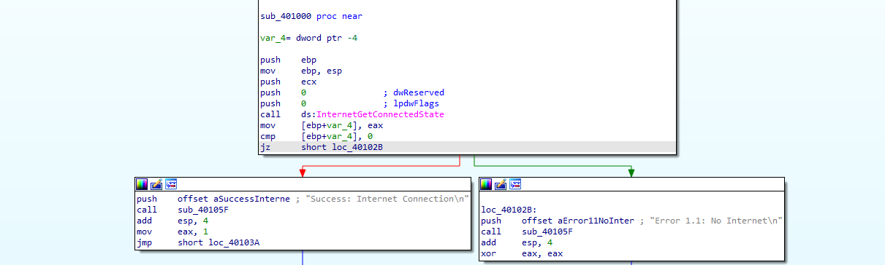
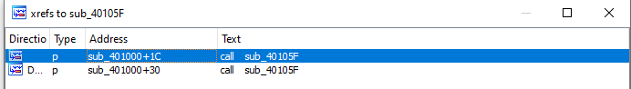

## Lab -1 Lab06-01.exe

**1. What is the major code construct found in the only subroutine called by main?**

- Only subroutine called in `main` &rarr; `sub_401000`

- Major code construct in  `sub_401000` is `if` statement check the `InternetGetConnectedState`

**2. What is the subroutine located at 0x40105F?**

`sub_40105F` located at `0x40105F` and there is two calls for this subroutine:

Function calls and above line:

    .text:0040102B                 push    offset aError11NoInter ; "Error 1.1: No Internet\n"
    .text:00401030                 call    sub_40105F

    .text:00401017                 push    offset aSuccessInterne ; "Success: Internet Connection\n"
    .text:0040101C                 call    sub_40105F

This looks like print some messages while malware running. `sub_40105F` is `printf` function.

**3. What is the purpose of this program?**

Main purpose of this program check the Internet connection on machine.

- If machine not connected to the internet output is `Error 1.1: No Internet`
- If machine  connected to the internet output is `Success: Internet Connection`
