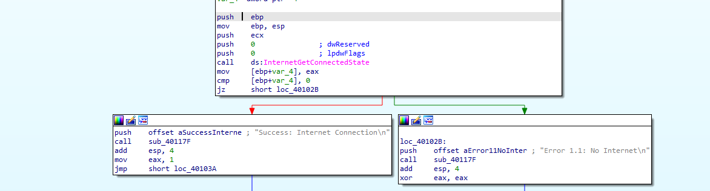
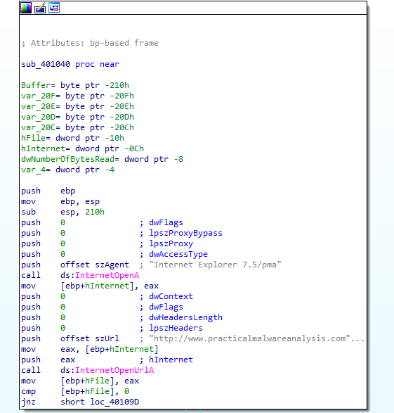
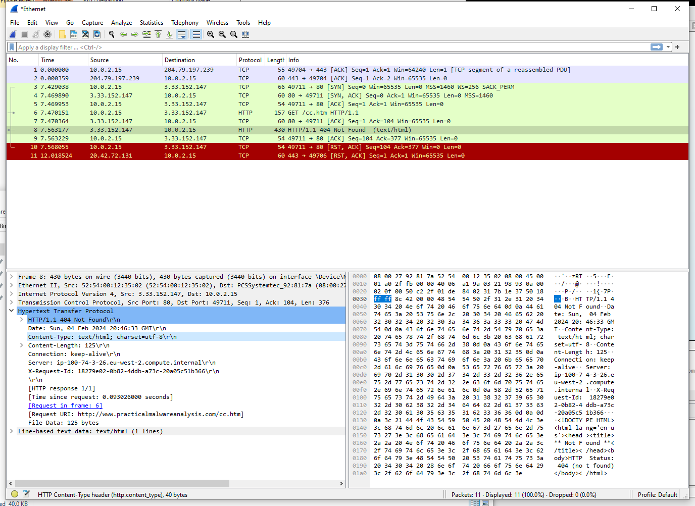

## Lab 6-2 Lab06-02.exe.

**1. What operation does the first subroutine called by main perform?**

In the `_main` section call `sub_401000`.

`sub_401000` check internet connection.

**2. What is the subroutine located at 0x40117F?**

`sub_40117F` located at `0x40117F`

**3. What does the second subroutine called by main do?**

Second subroutine called by main is `sub_401040`

This subroutine load file from `http://www.practicalmalwareanalysis.com` via `Internet Explorer 7.5/pma`

This subroutine use 4 different WinINET API calls:
- InternetOpenA
- InternetOpenUrlA
- InternetReadFile
- InternetCloseHandle

**4. What type of code construct is used in this subroutine?**

**5. Are there any network-based indicators for this program?**

Network-based indicators (located and use in `sub_401040`):

- `http://www.practicalmalwareanalysis.com`
- `Internet Explorer 7.5/pma`

6. What is the purpose of this malware?

(From static analysis)
- Check the internet connection on machine
- If machine has internet connection download file from `http://www.practicalmalwareanalysis.com`

(From dynamic analysis)
- Without internet connection we cannot observe activity of this malware.
- With internet connection when malware executed first checking internet connection and then execute other operations.
- Try to download a HTML file from `http://www.practicalmalwareanalysis.com` but this url may expired. Response 404

