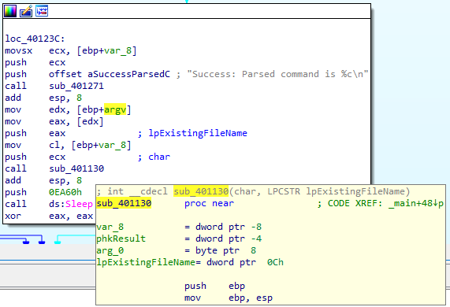
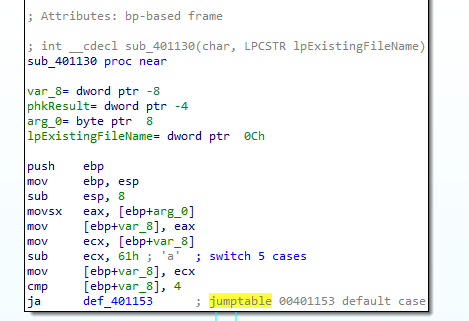
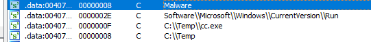

## Lab 6-3 Lab06-03.exe

**1. Compare the calls in main to Lab 6-2’s main method. What is the new function called from main?**

- `sub_401130` this subroutine different from Lab 6-2.

**2. What parameters does this new function take?**

`sub_401130` takes two parameters:

- char: Argument from HTML parsing. (from `aSuccessParsedC`)
- LPCSTR lpExistingFileName: `argv` from `main` subroutine

**3. What major code construct does this function contain?**

Majow code construct in `sub_401130` `switch` structure with jump tables. Switch according to command and do some following command executions:

    - Sleep
    - CreateDirectoryA
    - CopyFileA
    - DeleteFileA
    - RegSetValueExA
    - RegOpenKeyExA
    - printf (error statement)

**4. What can this function do?**

Accirding to switch statement this function can do the followings:

    - Sleep
    - CreateDirectoryA
    - CopyFileA
    - DeleteFileA
    - RegSetValueExA
    - RegOpenKeyExA
    - printf (error statement)

**5. Are there any host-based indicators for this malware?**

Host-based indicators:

**6. What is the purpose of this malware?**

Execution flow of this program:

- Check internet connection with `sub_401000`. If there is no internet connection program terminates.

- If there is an internet connection `sub_401040` subroutine executed and load HTML file from `http://www.practicalmalwareanalysis.com`

- Then parse the HTML file with `sub_401271` subroutine and extract command as parameter of `sub_401130`

- Lastly `sub_401130` execute proper switch statement according to parsed command.