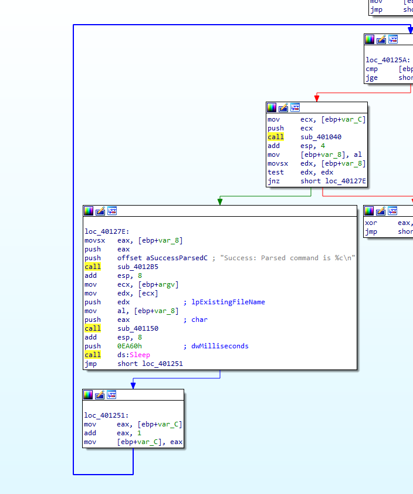

## Lab 6-4 Lab06-04.exe

**1. What is the difference between the calls made from the main method in Labs 6-3 and 6-4?**

There is no major differece calls:

    - sub_401000: Check internet connection
    - sub_401040: Load HTML File from internet and parsing
    - sub_4012B5: Printf method
    - sub_401150: switch statement function

**2. What new code construct has been added to main?**

There is `for` loop added to the `main`. Backwards arrow in IDA Pro graph mode:

**3. What is the difference between this lab’s parse HTML function and those of the previous labs?**

`sub_401040` did not take parameters previous labs but in Lab06-04.exe takes one parameter from the main `argv[0]`.

`offset Format   ; "Internet Explorer 7.50/pma%d"` also this part changed.

When we look at the paramater usage in `sub_401040` we observe that User-Agent part will change for each execution.

**4. How long will this program run? (Assume that it is connected to the Internet.)**

**5. Are there any new network-based indicators for this malware?**

`.data:004070C4	0000002F	C	http://www.practicalmalwareanalysis.com/cc.htm`

`.data:004070F4	0000001D	C	Internet Explorer 7.50/pma%d`
**6. What is the purpose of this malware?**

Execution flow of this program:

- Check internet connection with `sub_401000`. If there is no internet connection program terminates.

- If there is an internet connection `sub_401040` subroutine executed and load HTML file from `http://www.practicalmalwareanalysis.com`

- Then parse the HTML file with `sub_401271` subroutine and extract command as parameter of `sub_401130`

- Lastly `sub_401130` execute proper switch statement according to parsed command.

- Return to the second step (for loop). Execute `sub_401040` with different user agent. 