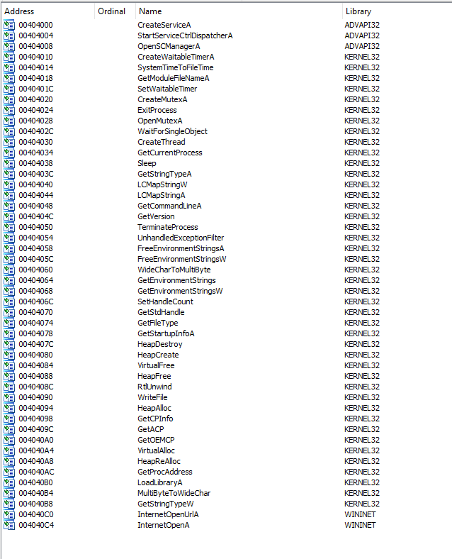
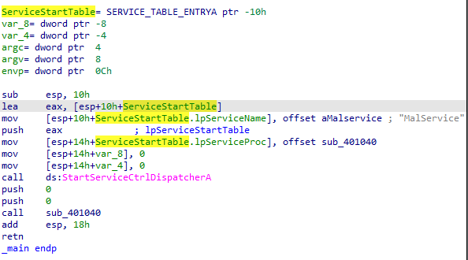
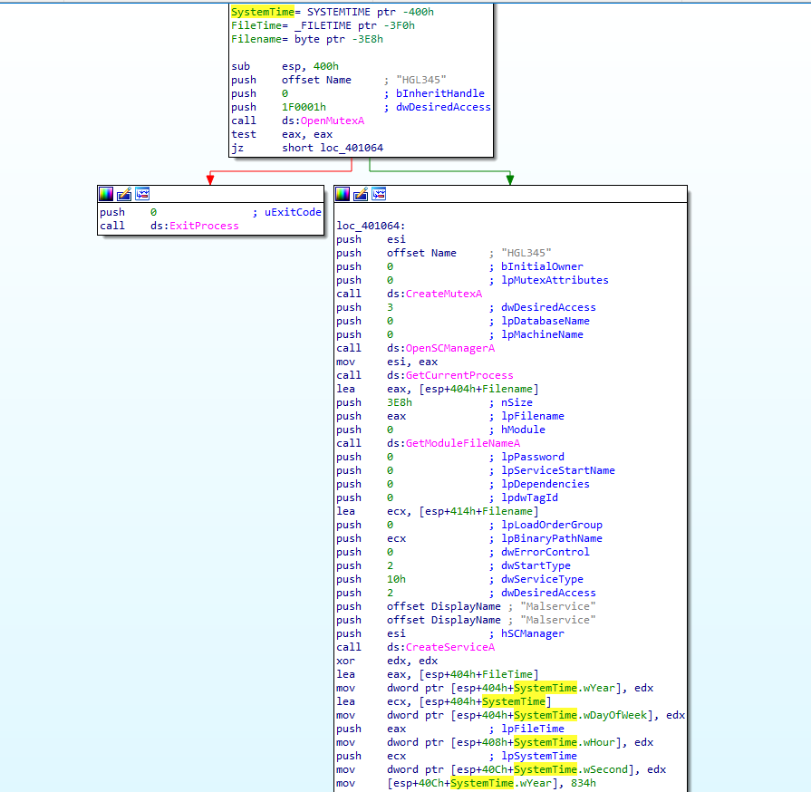
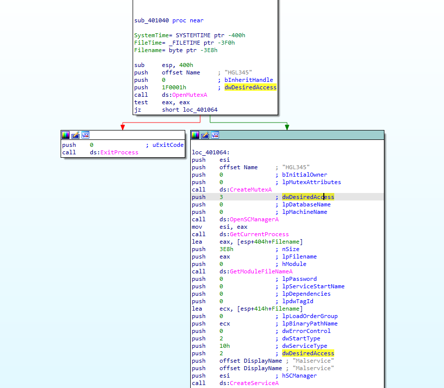
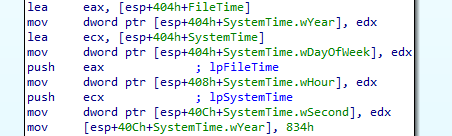
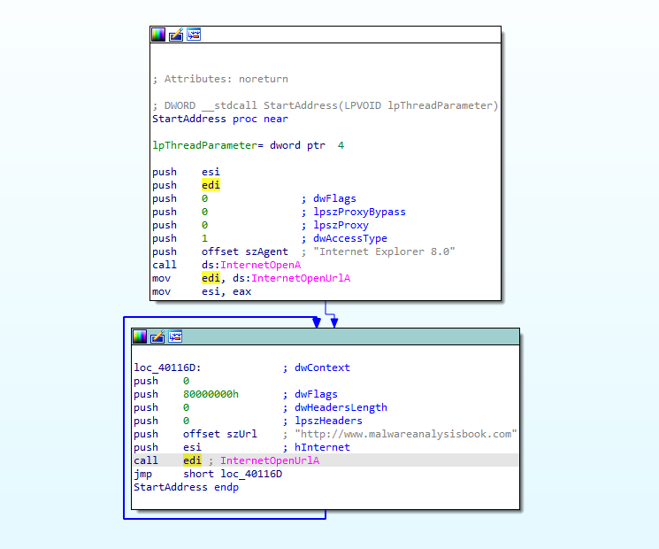

## Lab 7-1 Lab07-01.exe

**1. How does this program ensure that it continues running (achieves persistence) when the computer is restarted?**

List of imports:

Two suspicious imports:

    - CreateService
    - OpenSCManager

The `StartServiceCtrlDispatcher` function is typically used in the main function of a service program. Its purpose is to connect the main thread of a service process to the service control manager (SCM). The SCM is responsible for managing and controlling the operation of services on a Windows system.

https://learn.microsoft.com/en-us/windows/win32/api/winsvc/nf-winsvc-startservicectrldispatchera

After executing `StartServiceCtrlDispatcher` subroutine `sub_401040` executed.

This subroutine create mutex and service (`MalService`). Also this created service System.time values set in this function. So malware automatically run with that `MalService`.

**2. Why does this program use a mutex?**

In subroutine `sub_401040` malware open and create mutex.

According to `sub_401040` flow first `OpenMutexA` function call and then `CreateMutextA` or `ExitProcess` function call executed. So malware ensures that one execution at a time. If `OpenMutexA` return successfull malware terminated because malware execution in another process still executing.

**3. What is a good host-based signature to use for detecting this program?**

Network-based indicators:

    .data:00405050	00000023	C	http://www.malwareanalysisbook.com
    .data:00405074	00000016	C	Internet Explorer 8.0

**4. What is a good network-based signature for detecting this malware?**

In `sub_401040` malware manipulate system time values to set execution time.

    mov     [esp+40Ch+SystemTime.wYear], 834h
    mov     dword ptr [esp+404h+SystemTime.wDayOfWeek], edx
    mov     dword ptr [esp+408h+SystemTime.wHour], edx

This parts manipulate execution time of the malware according to system date-time. Set the execution time January-1-2100.

5. What is the purpose of this program?

- Persistance on the infected machine via registry manipulation to execute on startup.

- Set the execution time to the future to actual harmful actions. This will be sending requests infinitly to `http://www.malwareanalysisbook.com`.

6. When will this program finish executing?

Never. When malware infected on a system start automatically on startup. Wait until year 2100 and then infinitly request to url.

There is a unconditinal jump instraction that means infinite loop.
