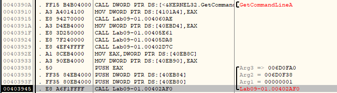

## Lab 9-1 Lab09-01.exe

**1. How can you get this malware to install itself?**

Main function at `0x403945` has three arguments.

In the main function at `0x402AFD` program checks number of command-line arguments is one. If number of command-line arguments is one continue execution at `0x401000`

If program executed with 1 command-line arguments, program open `HKEY_LOCAL_MACHINE\SOFTWARE\MICROSOFT \XPS` registery.

After `GetModuleFilenameA` function executed program find the path of the binary and add proper command to the register `EDX` for deleting binary.

