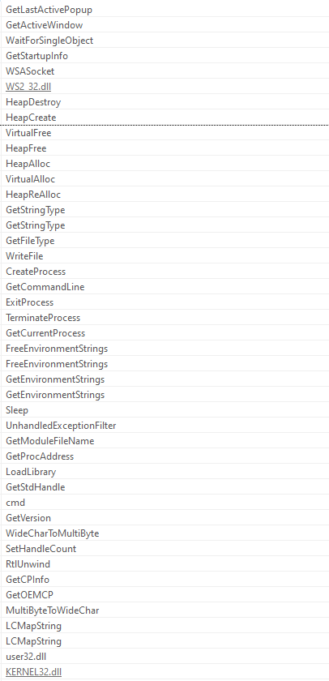
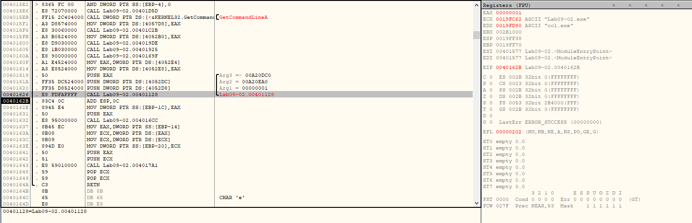
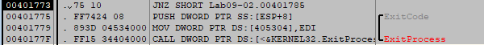
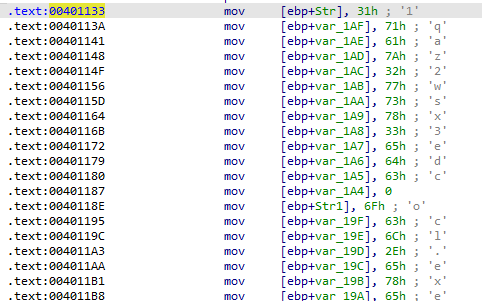

## Lab 9-2 Lab09-02.exe

**1. What strings do you see statically in the binary?**

**2. What happens when you run this binary?**

When trying to execute the binary, it terminates with no visible output or further actions.

**3. How can you get this sample to run its malicious payload?**

After function call at `0x401626` register EDX value set to the `ocl.exe` and register ECX value set to `Lab09-02.exe`.

When I tried to examine program behaviour about these register. Program check the binary name and if it is not equal to `ocl.exe` ExitProcess function executed.

**4. What is happening at 0x00401133?**

String Obfuscation

**5. What arguments are being passed to subroutine 0x00401089?**

Arguments passed to subroutine `0x00401089`: `1qaz2wsx3edc`

6. What domain name does this malware use?
7. What encoding routine is being used to obfuscate the domain name?
8. What is the significance of the CreateProcessA call at 0x0040106E?