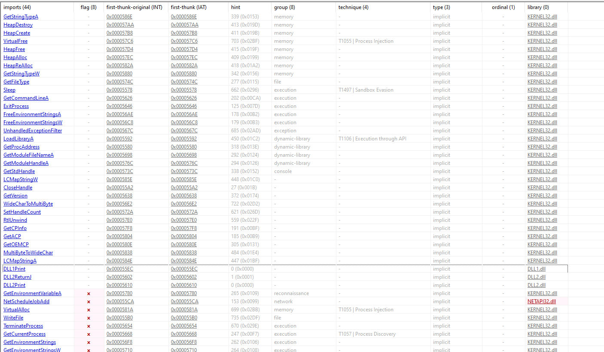
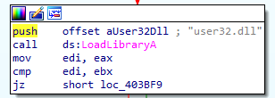
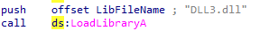
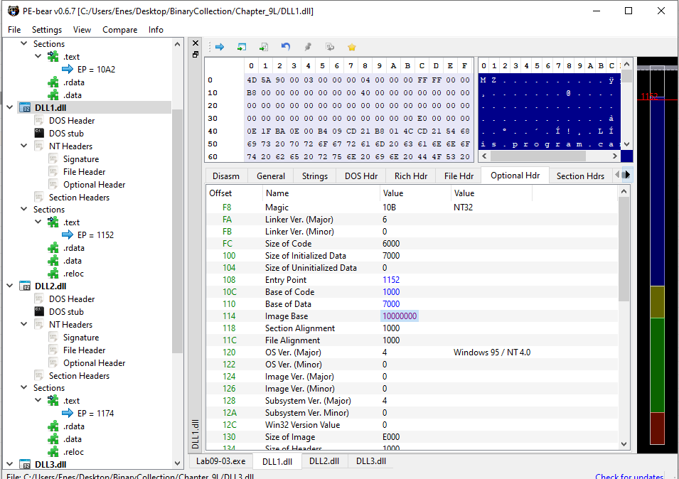
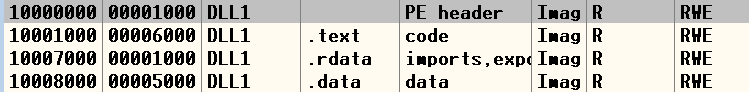
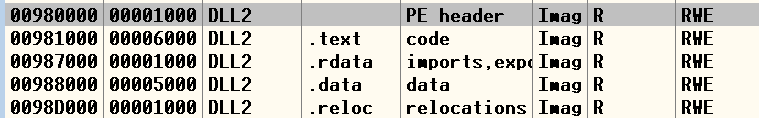
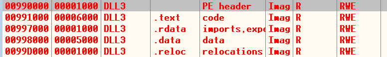
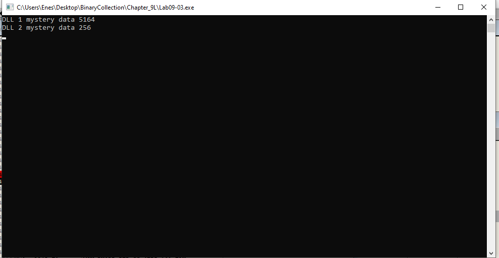
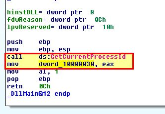

## Lab 9-3 Lab09-03.exe

**1. What DLLs are imported by Lab09-03.exe?**

Import table DLL loads:
- KERNEL32.dll
- DLL1.dll
- DLL2.dll
- NETAPI.dll

Dynamically import DLLs via `LoadLibraryA`

- user32.dll

- DLL3.dll

**2. What is the base address requested by DLL1.dll, DLL2.dll, and DLL3.dll?**

Base address off these DLLs is `0x10000000`

***Base Address of DLL***

https://learn.microsoft.com/en-us/cpp/build/reference/base-base-address?view=msvc-170

The /BASE linker option sets a base address for the program. It overrides the default location for an EXE or DLL file. The default base address for an EXE file is 0x400000 for 32-bit images or 0x140000000 for 64-bit images. For a DLL, the default base address is 0x10000000 for 32-bit images or 0x180000000 for 64-bit images.

**3. When you use OllyDbg to debug Lab09-03.exe, what is the assigned based
address for: DLL1.dll, DLL2.dll, and DLL3.dll?**

- DLL1.dll:` 0x10000000`

- DLL2.dll:` 0x98000000`

- DLL2.dll:` 0x99000000` (Load dynamically)

4. When Lab09-03.exe calls an import function from DLL1.dll, what does
this import function do?

`DLL1.dll` load `DLL1Print` function that prints the current process ID

