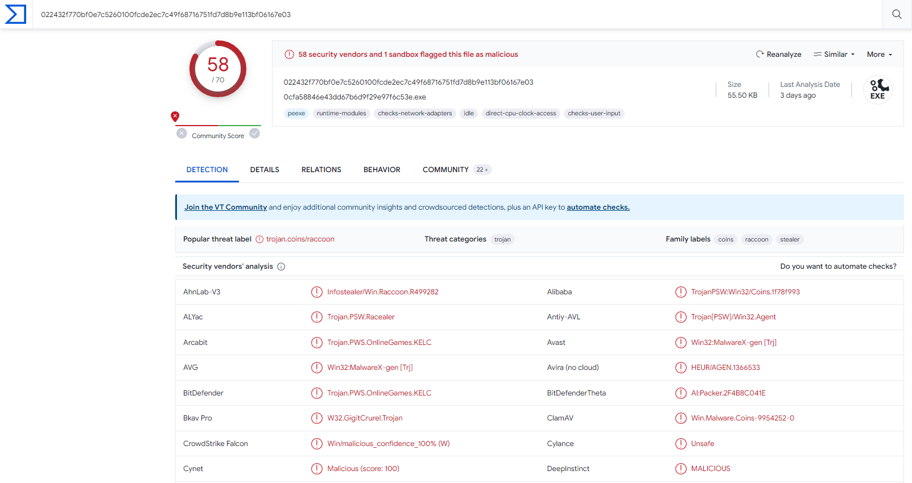
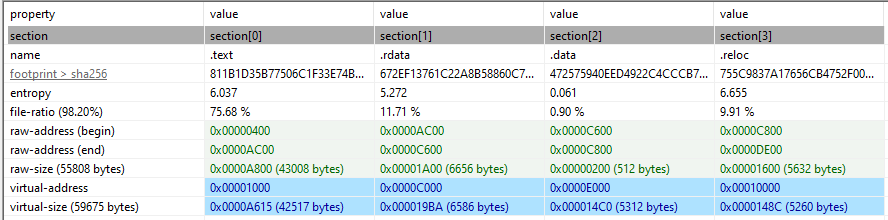
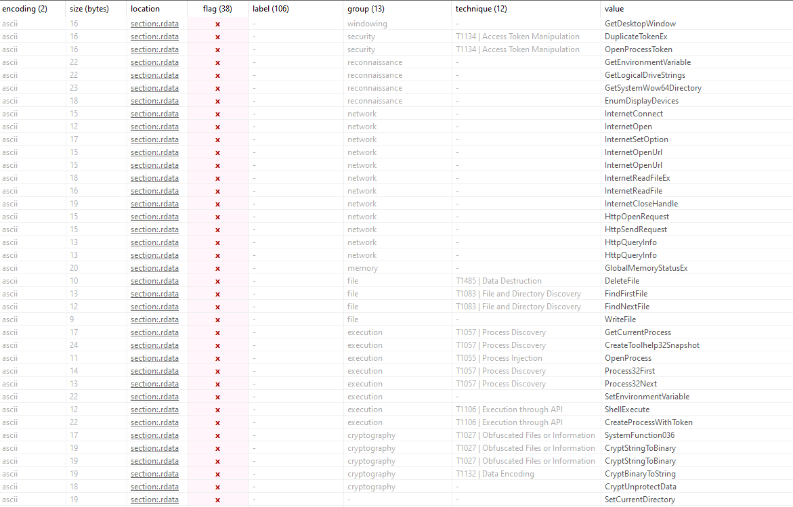

#### Static Analysis

    FileName: 022432f770bf0e7c5260100fcde2ec7c49f68716751fd7d8b9e113bf06167e03\022432f770bf0e7c5260100fcde2ec7c49f68716751fd7d8b9e113bf06167e03.exe
    MD5: 0cfa58846e43dd67b6d9f29e97f6c53e
    SHA256: 022432f770bf0e7c5260100fcde2ec7c49f68716751fd7d8b9e113bf06167e03

**VirusTotal Output**

**Packing Control**

Virtual size and raw size nearly similar. This could be not packed malware.

**Strings**

Strings have flag on pestudio:

Some suspicious string of the malware:

    InternetOpen
    InternetSetOption
    InternetOpenUrl
    InternetOpenUrl
    InternetReadFileEx
    InternetReadFile
    InternetCloseHandle
    HttpOpenRequest
    HttpSendRequest
    HttpQueryInfo
    HttpQueryInfo

**Libraries**

**Indicators**

**CAPA Analysis**

