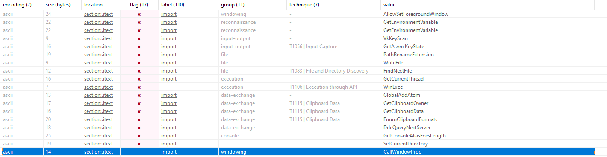

Malware sample source: `https://github.com/ytisf/theZoo/tree/master/malware/Binaries/ZeusBankingVersion_26Nov2013`

#### Static Analysis

    FileName: invoice_2318362983713_823931342io.pdf.exe
    MD5: ea039a854d20d7734c5add48f1a51c34
    SHA256:9615dca4c0e46b8a39de5428af7db060399230b2

**VirusTotal Output**

**Packing Control**

Virtual size and raw size nearly similar. This could be not packed malware.

**Strings**

Some suspicious string of the malware:

    FindNextFile
    GetAsyncKeyState
    PathRenameExtension
    WriteFile
    GetCurrentThread
    WinExec
    GlobalAddAtom
    GetClipboardOwner
    GetClipboardData
    EnumClipboardFormats
    DdeQueryNextServer
    GetConsoleAliasExesLength
    SetCurrentDirectory
    CallWindowProc
    UpdateWindow
    GetCapture
    IsWindowEnabled
    GetWindowTextLength
    DeleteCriticalSection
    SizeofResource
    GetLogicalDrives
    GetTickCount
    GetDriveType
    LocalUnlock
    HeapFree
    VirtualQueryEx
    LocalAlloc
    LocalFree
    CopyAcceleratorTable
    SwapMouseButton
    PathQuoteSpaces
    PathCombine
    GetCompressedFileSize
    CreateFileMapping
    GetPrivateProfileInt
    FreeLibrary
    GetModuleHandle

Also malware has some encrypted strings:

Also some random strings and function pair looks interesting. Some examples:

    AsksmaceaglyBubuPulsKaifTeasMistPeelGhisPrimChaoLyreroeno
    KERNEL32.MulDiv

    BagsSpicDollBikeAzonPoopHamsPyasmap
    KERNEL32.SetCurrentDirectory

**Libraries**

**Indicators**

Network-based indicators:

    pdata:004333F6	0000000B	C	corect.com

**CAPA Analysis**

