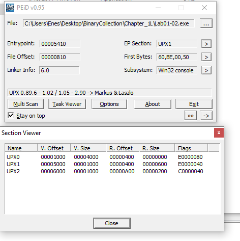
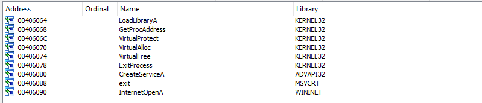
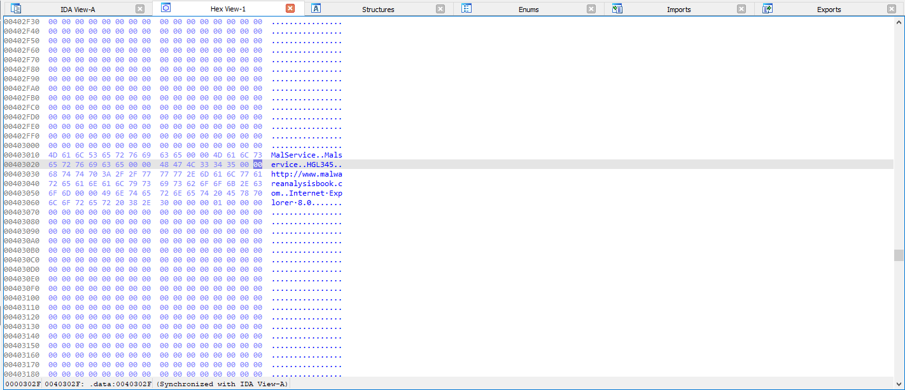

## Lab 1-1 (Lab01-01.exe and Lab01-01.dll)

**1. Upload the files to http://www.VirusTotal.com/ and view the reports. Does either file match any existing antivirus signatures?**

**2. When were these files compiled?**

Lab01-01.dll Compilation Date: Sun, Dec 19 2010, 16:16:38 - 32 Bit DLL
Lab01-01.exe Compilation Date: Sun, Dec 19 2010, 16:16:19 - 32 Bit EXE

**How PEiD check files?**
**Packer Signatures:** PEiD contains a database of signatures associated with various packers and compressors. These signatures are specific byte sequences or patterns that are characteristic of certain packing tools. PEiD compares these signatures against the analyzed file to identify the presence of a particular packer.

**Entropy Analysis:** Entropy is a measure of randomness within a file. Packed files often exhibit higher entropy compared to unpacked ones due to the compression or encryption applied. PEiD calculates the entropy of specific sections or the entire file and uses this information to make an assessment.

**Section Characteristics:** Packed files may have sections with unusual names, sizes, or characteristics. PEiD looks at the section headers of the PE file and examines whether they deviate from the standard characteristics expected in a compiled executable.

**Import Table Analysis:** Packed executables may modify the Import Address Table (IAT) to hide or obfuscate imported functions. PEiD checks the imported libraries and functions to identify any alterations that could be indicative of packing.

**Resource Section Examination:** Packed files may store their compressed or encrypted payload within the resource section. PEiD examines the resource section for irregularities or patterns that match known packers.

**Code Section Analysis:** Packed files often have code sections that exhibit specific characteristics, such as self-modifying code or runtime decryption routines. PEiD may analyze the code section to identify such behaviors.

**Compiler and Linker Information:** PEiD also looks at information related to the compiler and linker used to create the executable. Certain compilers are more commonly associated with packed files.
**Heuristic Analysis:** PEiD employs heuristics based on experience and knowledge of common packing techniques. These heuristics may include checks for specific instructions or sequences that are typical in packed files.

**3. Are there any indications that either of these files is packed or obfuscated? If so, what are these indicators?**
 
Lab01-01.dll Not Packed and Not Obfuscated

Lab01-01.exe Not Packed and Not Obfuscated

**4. Do any imports hint at what this malware does? If so, which imports are they?**

Imports of Lab01-01.dll

Imports of Lab01-01.exe

**5. Are there any other files or host-based indicators that you could look for on infected systems?**

**Host-based indicators** in malware analysis are signs of malicious activity found on an individual system. Examples include unusual files, changes to the Windows Registry, suspicious network connections, unauthorized processes, and alterations to user accounts or system logs. Analyzing these indicators helps identify and mitigate the impact of malware on a specific host.

**6. What network-based indicators could be used to find this malware on infected machines?**

**Network-based indicators** in malware analysis are observable patterns of malicious behavior at the network level. Examples include connections to known malicious IP addresses, communication with suspicious domains, unusual traffic patterns, and exploitation attempts through specific protocols or ports. Analyzing these indicators helps identify and block malicious activities within a network.

**7. What would you guess is the purpose of these files?**

- Lab01-01.dll might be backdoor malware because of unusual IP addres usage: 127.26.152.13 and ***WS2_32.dll*** import.

Indicators of a **backdoor** include unusual network traffic patterns,unusual IP addresses, unexpected process behaviors, unauthorized access attempts, irregular system activities, abnormal resource usage, changes in registry entries, persistence mechanisms, code injection techniques, encryption or obfuscation, and communication with command and control servers. Monitoring for these signs helps detect and respond to the presence of backdoors on compromised systems.

- Lab01-01.exe imports FindNextFile and CopyFile. This file purpose might be search a file, find and executed. May use for execute Lab01.01.dll

## Lab 1-2 (Lab01-02.exe)

#### 1. Upload the Lab01-02.exe file to http://www.VirusTotal.com/. Does it match any existing antivirus definitions?

#### 2. Are there any indications that this file is packed or obfuscated? If so, what are these indicators? If the file is packed, unpack it if possible.

[Unpacking Malware Medium Blogpost](https://medium.com/@dbragetti/unpacking-malware-685de7093e5)

Lab01-02.exe packed

- Virtual size and raw size of the Lab01-02.exe not match. This is a indicator of packed file.

- Unpackking File

#### 3. Do any imports hint at this program’s functionality? If so, which imports are they and what do they tell you?

**Imports of packed .exe**

**Imports of unpacked .exe**

#### 4. What host- or network-based indicators could be used to identify this malware on infected machines?

Some suspicious indicators:
    - `MalService`
    - `Malservice`
    - `HGL345`
    - `http://www.malwareanalysisbook.com`

